# Anomaly Detection in Network Traffic

Detecting cyberattacks in network traffic using both **supervised** (Logistic Regression, Random Forest) and **unsupervised** (Isolation Forest, Autoencoder) machine learning approaches on the [CICIDS2017](https://www.unb.ca/cic/datasets/ids-2017.html) dataset.

> MSc coursework — Machine Learning (M430), National and Kapodistrian University of Athens, 2026.

---

## Overview

Modern networks face a growing volume of sophisticated attacks that traditional signature-based systems struggle to detect. This project compares ML and DL approaches for **binary anomaly detection** (benign vs. attack), focusing on class imbalance and the detection of previously unseen (zero-day) attacks.

---

## Key Results

| Model | Accuracy | Precision | Recall | F1-Score |
|---|---|---|---|---|
| Logistic Regression | 0.918 | 0.717 | 0.961 | 0.821 |
| **Random Forest** | **0.999** | **0.996** | **0.998** | **0.997** |
| Isolation Forest | 0.858 | 0.725 | 0.448 | 0.554 |
| Autoencoder | 0.881 | 0.912 | 0.438 | 0.591 |

-  **Random Forest** achieves near-perfect performance (F1 ≈ 0.997)
-  **Autoencoder** improves precision over Isolation Forest for anomaly detection
-  Clear comparison between supervised and unsupervised approaches on imbalanced data

---

##  Results Visualization

### Logistic Regression
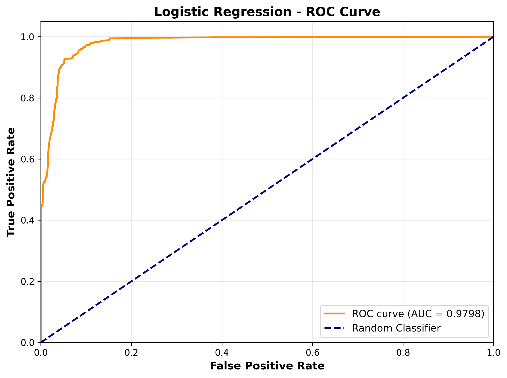

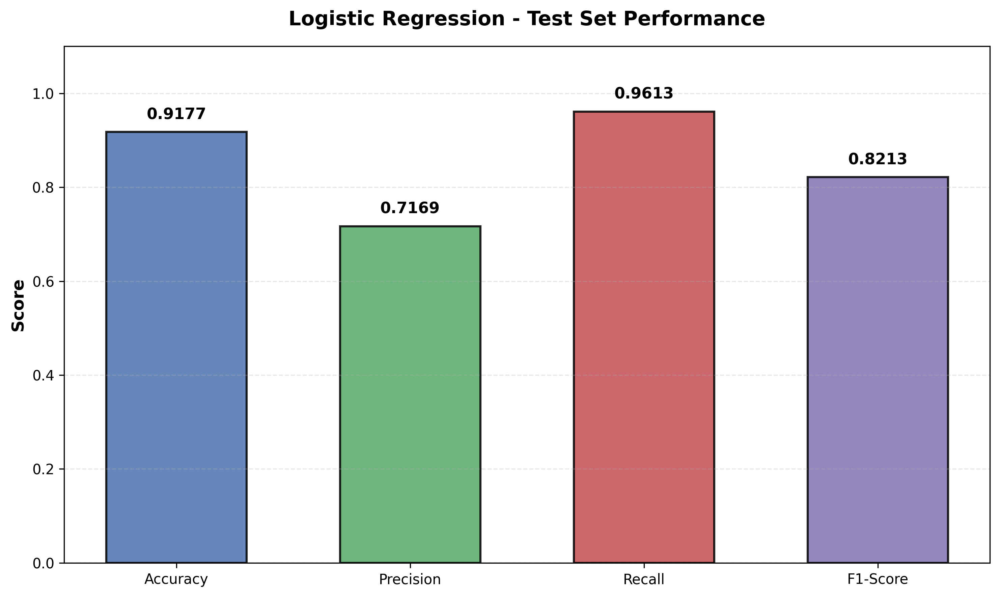

---

### Random Forest
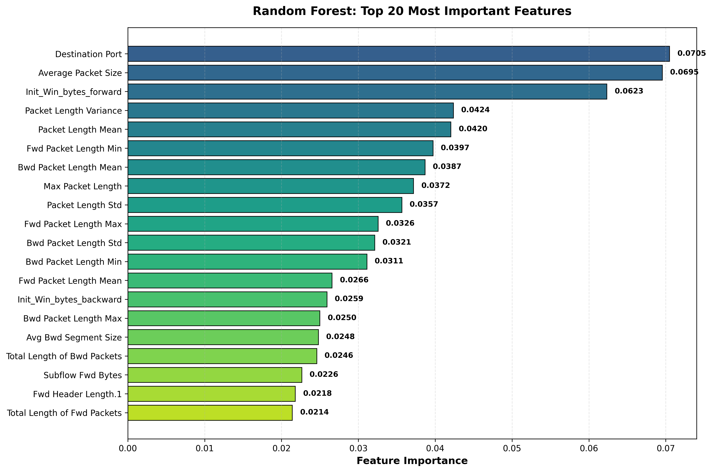
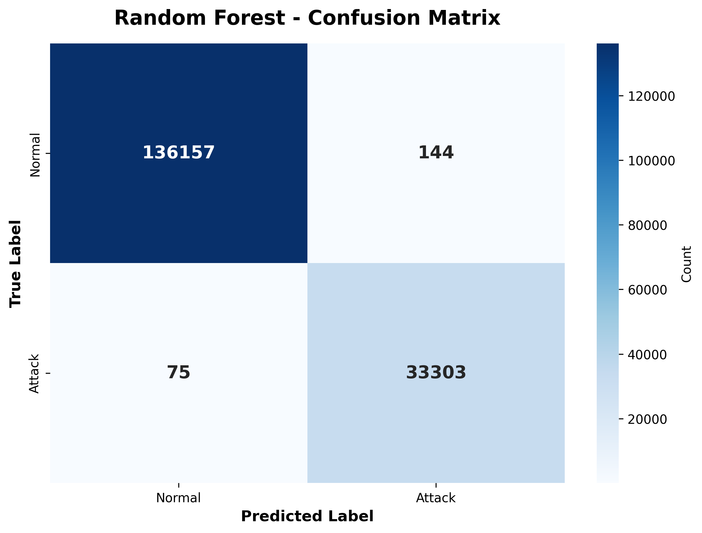
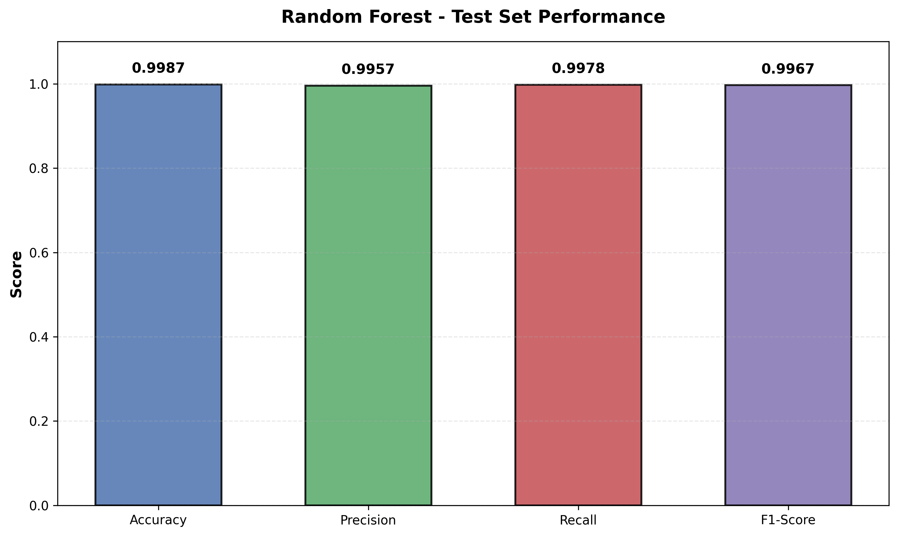
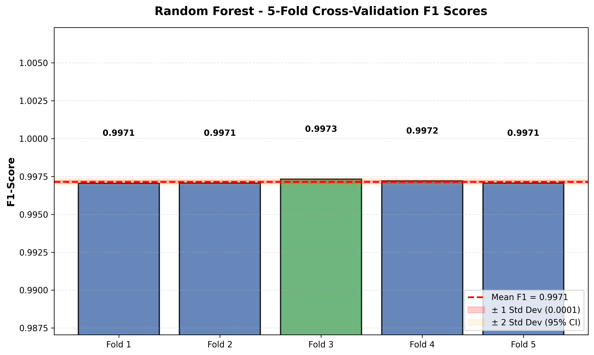

---

### Isolation Forest
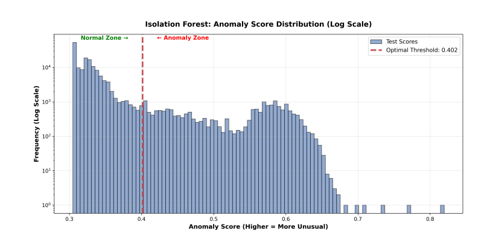

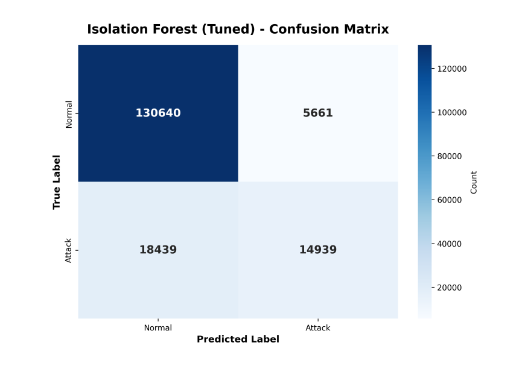

---

### Autoencoder
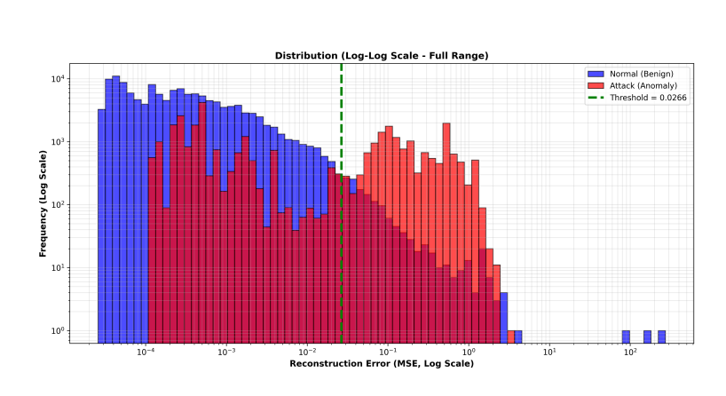
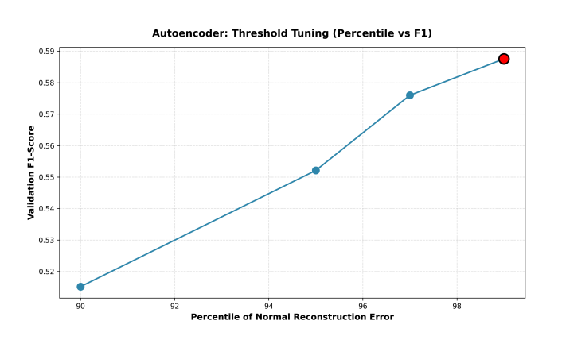
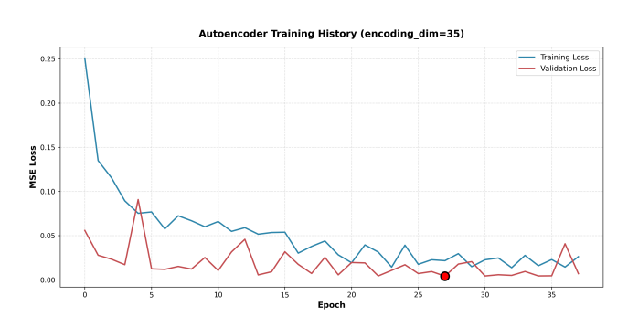

---

### Model Comparison
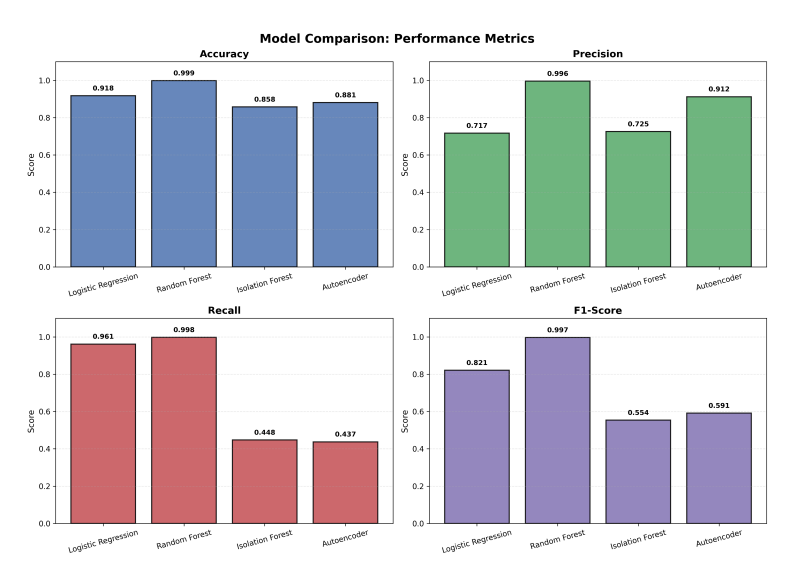
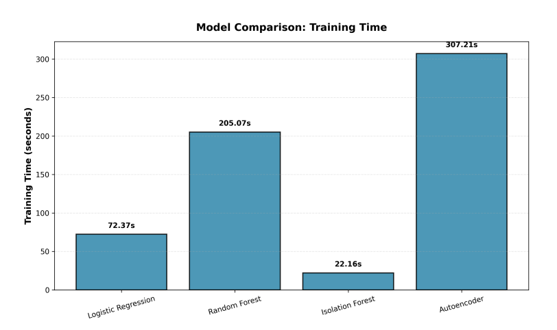

---

## 📁 Repository Structure
